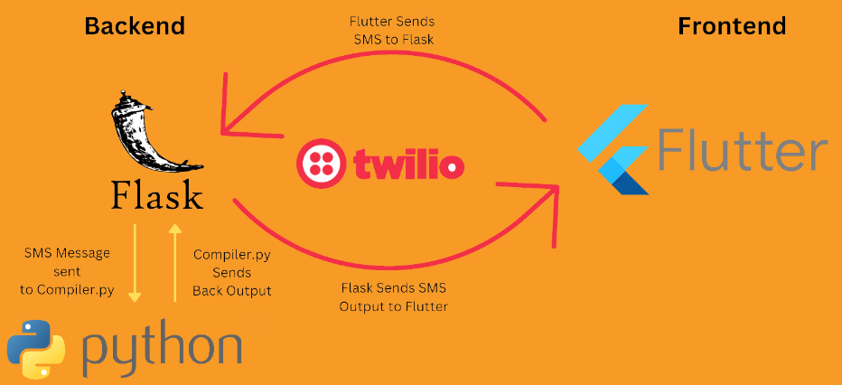

  

 
TextPy is an innovative microservice application that seamlessly integrates SMS communication to facilitate the exchange of data between a Flutter Mobile Application and a backend Flask application. Through the Twilio API, our application empowers users to send python code and receive real-time interpreted results. 
 

---

## About TextPy

TextPy is a versatile message-based application designed to facilitate the exchange of discrete Python code packets between a Flask backend and a Flutter frontend. The application leverages SMS messaging as the communication medium, enabling seamless code transmission and interpretation.

The Flask backend, implemented in Python, serves as the heart of the TextPy application. It encompasses the API functionality responsible for handling code compilation and execution. The backend utilizes the subprocess library to interpret Python code received as SMS messages, ensuring accurate results. It also integrates with Twilio, a renowned SMS service provider, to enable sending and receiving of SMS messages.

To provide a user-friendly interface, the Flutter frontend, developed using Dart, complements the Flask backend. It allows users to compose and send Python code snippets as SMS messages effortlessly. The frontend also displays the interpreted results received from the Flask backend, providing a smooth and interactive user experience.

In the GitHub repository, the project's structure is organized into separate directories for the Flask backend and Flutter frontend. The Flask backend directory contains modules responsible for API functionality, code compilation, and interaction with Twilio. The API module handles routing and endpoint configuration, allowing users to interact with the TextPy application. The code compilation module includes functions that utilize the subprocess library to execute Python code securely. Additionally, the Twilio integration module handles sending and receiving SMS messages, establishing seamless communication with users.

On the Flutter frontend side, the directory structure follows standard Flutter conventions. It includes files such as main.dart, which acts as the entry point for the application. The frontend utilizes Flutter widgets to build an intuitive user interface, consisting of screens for composing and sending SMS messages, as well as displaying received code interpretation results.
 

---

## Design Model
 

  

 

---

## Authors

Elliot Fayman, Christina Mourad, and Ryan Kao.
